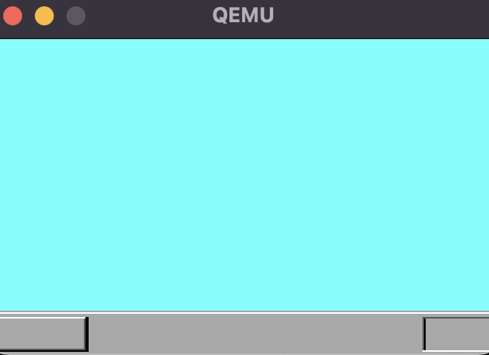

# OS-selfmade

This repository uses golang to create an OS kernel.

```shell
$ vagrant up
$ make run-qemu
```

If you run the above in `go-day4/harib01h`,
you should see the following appear in qemu.

